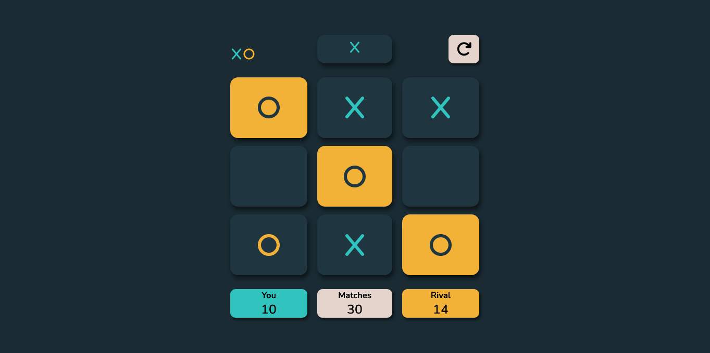

# Tic Tac Toe Game



# introduccion

Tic Tac Toe (3 en línea) Con diseño Responsive 
y opciones para jugar contra la CPU u otro 
usuario en el mismo sistema.

# Tecnologias usadas

-React Js
-Sass
-Github Pages
-React Icons
-Vite

# Diseño

diseño basado en el Reto de frontend Mentor:
[https://www.frontendmentor.io/challenges/tic-tac-toe-game-Re7ZF_E2v]

Iconos por Font Awesome 6
[https://fontawesome.com/]

## Instalación

1. Clona este repositorio:

```bash
git clone https://github.com/tu-usuario/tic-tac-toe.git
cd tic-tac-toe
```

2. Instalar las dependencias

```bash
npm install
```

3. Inicia la aplicación:

```bash
npm start
```